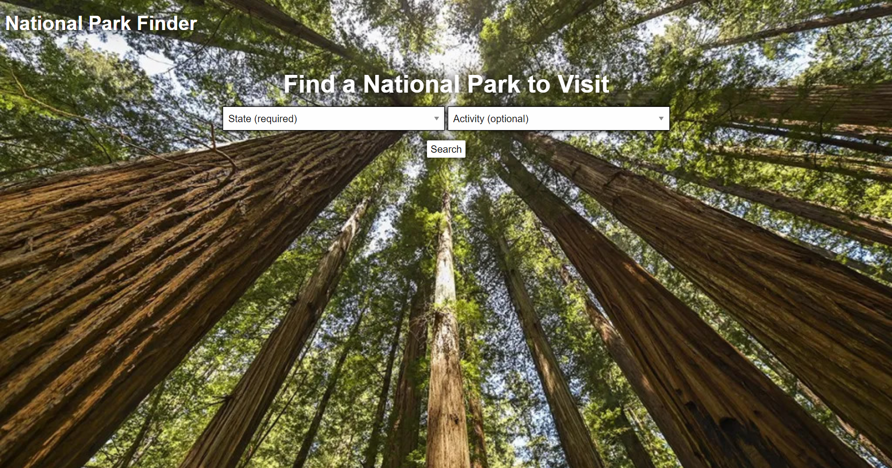
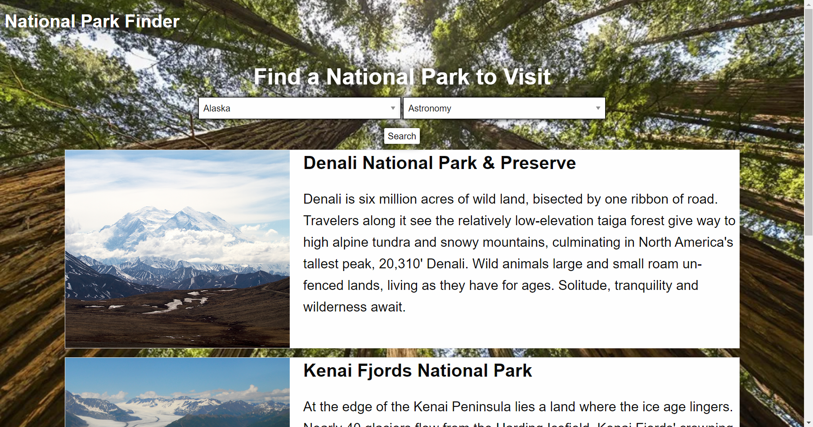
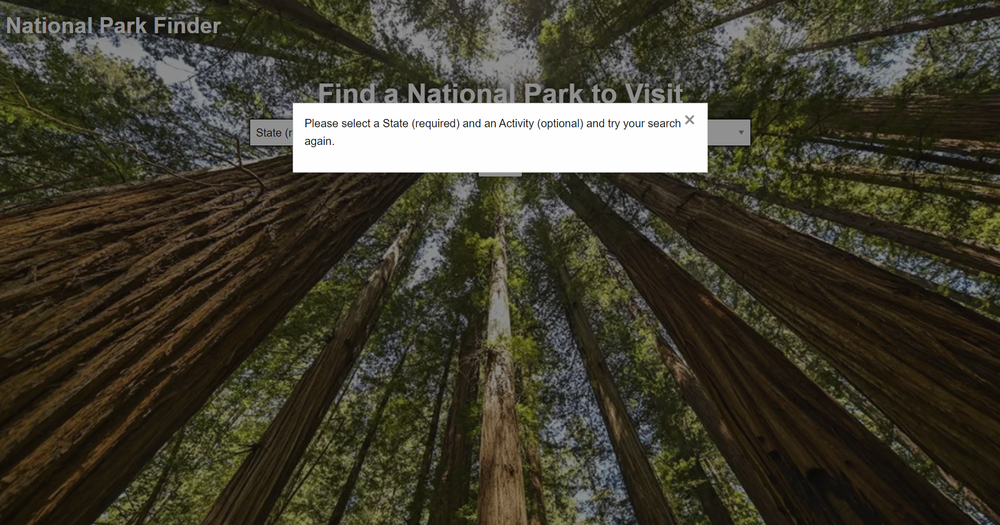
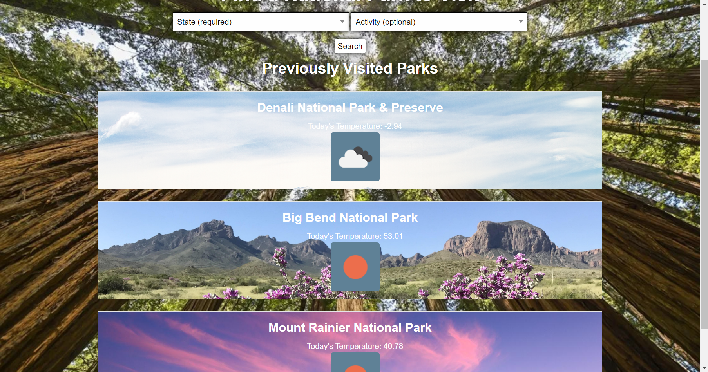
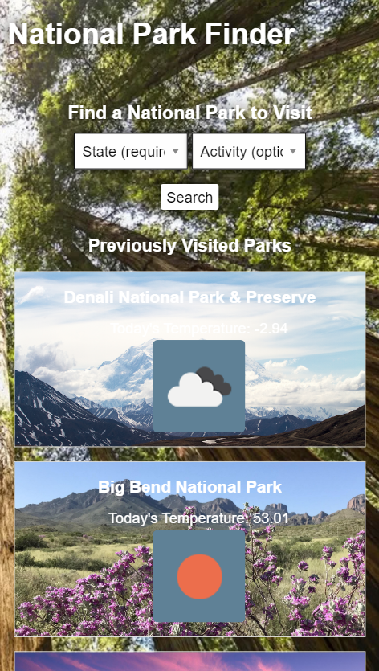
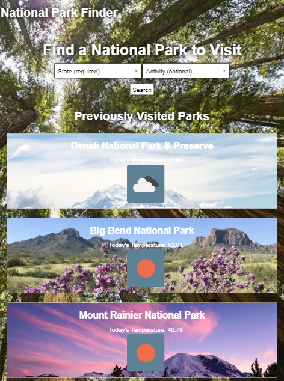

# National Park Finder <!-- omit in toc -->
- [Description](#description)
- [User Story](#user-story)
- [Acceptance Criteria](#acceptance-criteria)
- [Technologies Used](#technologies-used)
- [Demo and Usage](#demo-and-usage)
- [EXTRA](#extra)

## Description
National Park Finders.
This is a terrific application website that can be used by anyone wanting to use the internet to gather weather information about certain times of the day, certain times of the week and even certain times of the month about information that is critical of the weather which plays a vital role in our every day lifestyle's. For example the prediction of snow, rain and even ice-storms, this sort of information would be deem very useful to anyone and even especially when planing events on certain days of the week or even different times of the year. The application is centered on recreational parks and weather predictions and gives information that might be useful to someone wanting to for example schedule an outdoor event. This information can easily be gathered from its sleek and easy to use web interface that allows a user the ability of easy to use drop down search buttons that gives the names of all US states and a list of all sorts of activities that anyone might be interested in. This website can also be used to gather weather information on search topics, such as past historical events and even future predictions and so on. By just clicking on any state or activity from a given list you the user are given the information in real time, so this application in fact would be very useful to anyone who relies on the weather.

## User Story
```
AS A national park enthusiast
I WANT to see national park acitivities and local weather
SO THAT I can plan trips to national parks accordingly
```

## Acceptance Criteria
```
GIVEN a search engine for national park information
WHEN I load the application
THEN I am presented with a dropdown menus for activity type and state
WHEN I search using the activity and/or state criteria
THEN I am presented with national parks that match my search
WHEN I click on a national park
THEN I can view more detailed information about the park including current weather, 5-day forecast, address, pictures, and activities/events
WHEN I reload page
THEN I am presented with national parks that I viewed more information on
```

## Technologies Used
### HTML, CSS, JavaScript <!-- omit in toc -->
HTML provides the backbone for this application. In HTML, we outline the structure of the application and what information users will see upon loading the webpage. HTML is also used to define the modal and park result divs in the HTML and use JavaScript to populate those divs with information. Using this methodology, parent divs will appear and interact with the other html content as expected.

Most of the CSS in this project comes from Foundations, however custom CSS is implemented to make up for areas that Foundations doesn't cover. This includes general color themes, type-faces, font-sizing, padding, and margins.

JavaScript is the heavy lifter in this project. JavaScript gives the application access to Foundations content that is reliant on jQuery and JavaScript to work. JavaScript is also used to make API calls, dynamically generate HTML content, and cache user inputs and other data in localStorage.

### Zurb Foundations CSS Framework <!-- omit in toc -->
[Foundations](https://get.foundation/sites/docs/) is used to provide general structure to the webpage. The grid layout, for instance, is provided by the Foundations framework. Foundations is also used to create advanced components, such as the error and park modals (called reveals in Foundations).

### jQuery <!-- omit in toc -->
[jQuery](https://api.jquery.com/), is generally used for it's helpful methods for DOM manipulation. Unfortunately, jQuery is only used as a prequisite for Foundations for this project. Instead of jQuery, native JavaScript is used to reference and make changes to the DOM.

### Moment <!-- omit in toc -->
[Moment](https://momentjs.com/), is used for creating date/time objects, formatting them, and adding them to weather cards so users can associate the forecast with the correct date.

### National Park Service API <!-- omit in toc -->
The [National Park Service API](https://www.nps.gov/subjects/developer/api-documentation.htm) is used to get data about national parks in the United States and it's territories. That data is then used to populate park information, such as images and descriptions of parks, to the application. The location data from this API call is also used to get local weather data on that park from the OpenWeather API.

### OpenWeather API <!-- omit in toc -->
[OpenWeather API](https://openweathermap.org/api) is used to get current weather and weather forecasting for a chosen park. Weather data is then populated to the application for the user to see local weather at a park location.


## Demo and Usage
Click on the first image to get linked to our demo video! You can also view the video transcript [here](https://docs.google.com/document/d/1XS9q8yyOWKTFK21qmrDNGfIPZDCOTBMY1jPg-9qSgEk/edit?usp=sharing).

The user is pointed toward the search bar. The drop down menus provide the user with options for their national park search.
[](https://youtu.be/-uKMij6askM)

A user's search will bring up all national parks that match the input parameters.


Using client-side validation, users are infomred when they made a unfulfillable query.


Each park in a search is clickable to provide the user with more information, including a five-day weather forecast.


Previously clicked parks are saved in local storage and appear on the landing page upon reloading the application. These previously clicked parks additional show current weather upfront, and are still clickalbe to provide additional information.


The app was built mobile-first and therefor the phone and tablet versions looks crisp and are easily scrollable on either type of device.





## EXTRA
-   carousel for images in modal
-   include territories in search options
-   add topics search option
-   show sunrise/sunset times in park modal
-   show things-to-do and activities in park modal
-   add badge system when park is visited
-   add pagination so can return more than 100 items on search (can remove state error that way too)
-   revise search to be more modular (searching multiple states at once)
-   modal is more interactive (can click weather icon for forecast, can click map for direciton information, etc.)
-   favicon!
-   switch moment.js to day.js
-   on hover styling for park cards
-   bug/fix clicking park multiple times amkes park show up multiple times in previously searched
-   Accessibility?
-   background image isn't centered on smaller screens
-   make search parameters bigger on phone
-   modal at top of the page instead of being created on place where user clicked
-   feature to send user to previously park page on clicking the header